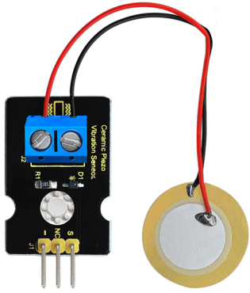
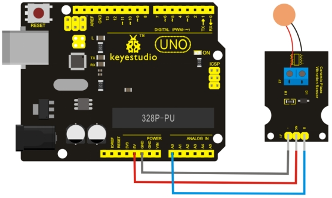
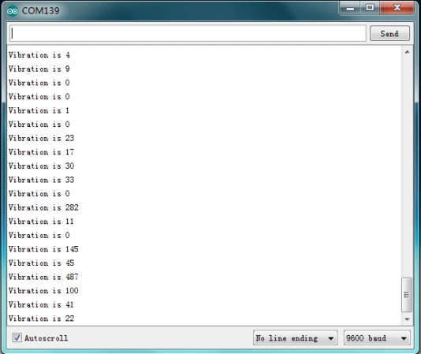

# KS0272 keyestudio Analog Piezoelectric Ceramic Vibration Sensor



## 1. Introduction

This vibration sensor is based on piezoelectric ceramic chip analog vibration. It makes use of the anti-conversion process that piezoelectric ceramic vibration will generate the electric signals.

When vibrating the piezoelectric ceramic chip, the sensor’s signal terminal will generate electrical signals.

The sensor can be used with Arduino dedicated sensor shield, and Arduino analog port can perceive weak vibration signals, so that it can make interactive works related to vibration, such as electronic drum.

Connect the vibration sensor to the analog port A0 of Arduino UNO. When vibrating the sensor in different degrees, you will see the different output value displayed on serial monitor.

## 2. Specification

- Supply Voltage: 3.3V to 5V
- Working Current：<1mA
- Working Temperature Range：－10℃～＋70℃
- Output Signal：analog signal

## 3. Connection Diagram



## 4. Sample Code

Download Code : [Code](./Code.7z)

```c
void setup()
{
	Serial.begin(9600); //Open the serial to set the baud rate for 9600bps
}
void loop()
{
    int val;
    val=analogRead(0); //Connect the analog piezoelectric ceramic vibration sensor to analog interface 0
    Serial.print("Vibration is ");
    Serial.println(val,DEC);//Print the analog value read via serial port
    delay(100);
}
```

## 5. Result

Wiring as the above diagram and upload well the code, after power-on, open the serial monitor, then set the baud rate as 9600. When vibrating the ceramic chip, you will see the data as the figure shown below.

